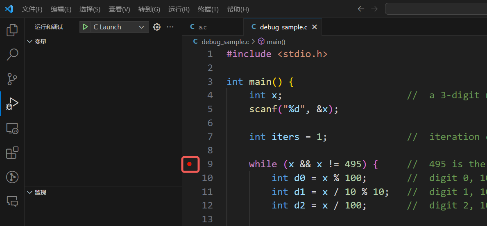
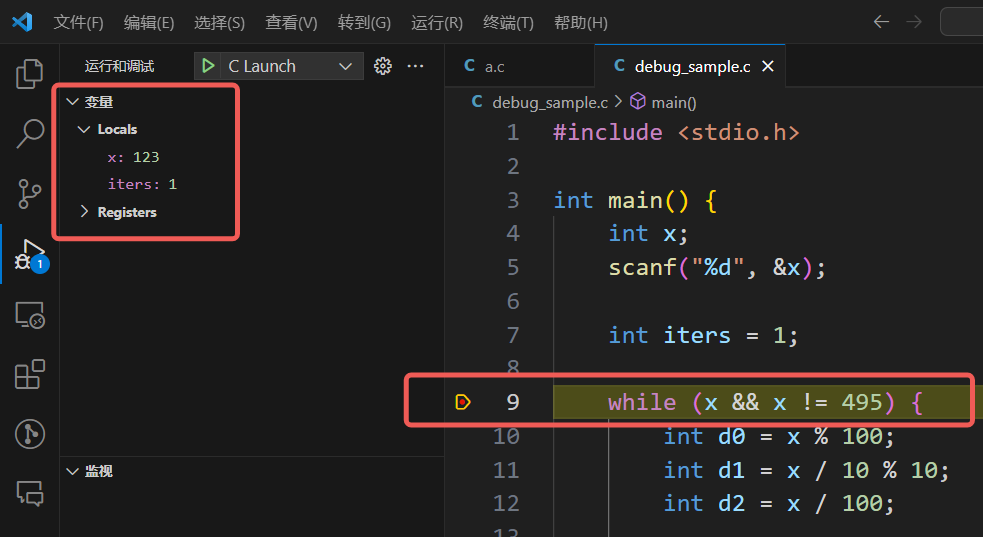
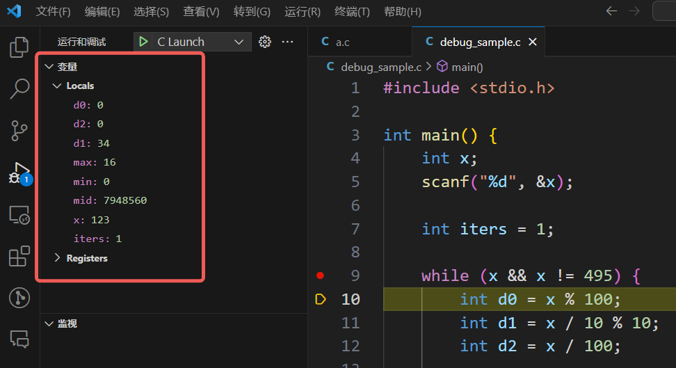
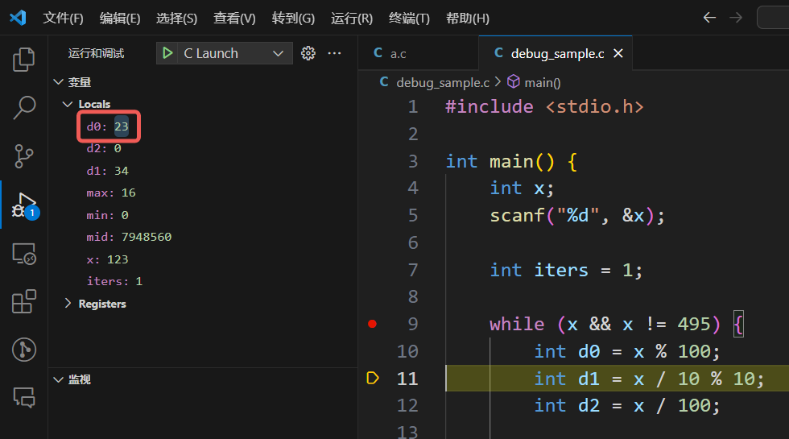

# 调试样例

回顾 W2 课内的第三道编程题“黑洞数”。

## 题面

黑洞数也称为陷阱数，又称“Kaprekar 问题”，是一类具有奇特转换特性的数。

任何一个各位数字不全相同的三位数，经有限次“重排求差”操作，总会得到 495。最后所得的 495 即为三位黑洞数。所谓“重排求差”操作即组成该数的数字重排后的最大数减去重排后的最小数。（6174 为四位黑洞数。）

例如，对三位数 207：

第1次重排求差得：720 - 27 = 693；

第2次重排求差得：963 - 369 = 594；

第3次重排求差得：954 - 459 = 495；

以后会停留在 495 这一黑洞数。如果三位数的 3 个数字全相同，一次转换后即为 0。

任意输入一个三位数，编程给出重排求差的过程。

### 输入格式：
输入在一行中给出一个三位数。

### 输出格式：
按照以下格式输出重排求差的过程：

```
序号: 数字重排后的最大数 - 重排后的最小数 = 差值
```

序号从1开始，直到495出现在等号右边为止。

### 输入样例：
```
123
```

### 输出样例：
```
1: 321 - 123 = 198
2: 981 - 189 = 792
3: 972 - 279 = 693
4: 963 - 369 = 594
5: 954 - 459 = 495
```

代码长度限制：16 KB

时间限制：400 ms

内存限制：64 MB

## 样例代码

!!! warning "注意，以下的代码是有错的，我们希望进行 debug"

```c
#include <stdio.h>

int main() {
    int x;                      //  a 3-digit number
    scanf("%d", &x);

    int iters = 1;              //  iteration count

    while (x && x != 495) {     //  495 is the magic number
        int d0 = x % 100;       //  digit 0, 10^0, unit's digit
        int d1 = x / 10 % 10;   //  digit 1, 10^1, ten's digit
        int d2 = x / 100;       //  digit 2, 10^2, hundred's digit

        int max = d0;           //  max digit
        int min = d1;           //  min digit
        int mid = d2;           //  middle digit

        if (d1 > d0) {
            max = d1;
            min = d0;
        }   //  default: d1 <= d0, max = d0, min = d1

        if (d2 > max) {
            mid = max;
            max = d2;
        }   //  default: d2 <= max, mid = d2 (can < min)

        if (min > mid) {
            int tmp = min;
            min = mid;
            mid = tmp;
        }   //  default: min <= mid, unnecessary to swap
        
        x = 99 * (max - min);   //  next number
        printf (
            "%d: %d - %d = %d\n",
            iters, 
            100 * max + 10 * mid + min,
            100 * min + 10 * mid + max,
            x
        );
        iters++;
        //  if maxd = mind = midd, x = 0, loop ends
    }

    return 0;
}
```

!!! info "当然，在变量的设计等方面这段代码可以再进行更多优化，不过在此就不详细讨论了"

先简单解释一下算法思想。`d0, d1, d2` 分别是三位数的个位、十位、百位，`max, mid, min` 分别是三个数位中最大的、居中的和最小的，`iter` 为迭代次数。每轮迭代更新 `x`，使用的公式为

$$
\begin{aligned}
    x &= (100\cdot max + 10\cdot mid + min) - (100\cdot min + 10\cdot mid + max)\\
    &= 99\cdot (max - min)
\end{aligned}
$$

按照黑洞数的要求，循环的中止条件为 495。另外，当 `x=0` 时，可知对应 `max=min=mid`，即三个数位都相同，应当中止。

中间的三个 if 语句 (18-32 行) 用途是对 `d0, d1, d2` 进行排序，从而得到 `max, mid, min`。对 `max, mid, min` 初始化为 `d0, d2, d1`，这样只有必要时才修改初始化的默认值，可以省去 else 语句。例如第一个 if 语句，只有 `d1 > d0` 时才有必要修改初始化的默认值。

程序编译运行之后，发现死循环。输入 123，输出为
```
...
7688: 5495 - 1040 = 4455
7689: 5945 - 995 = 4950
...
```

## printf 大法

回顾我本人应用 printf 大法的框架：

- 定位问题发生的区域
- 定位异常变量
- 定位问题发生的代码

这里发生的问题是死循环，那么首先定位问题发生的区域，由于该代码中只有一个循环（9-44 行的循环），因此关注为什么这里始终死循环出不去。`x=0` 是特殊的输入才会触发的终止条件，那么关键就是无法正常计算得到 495。（从题目要求的输出已经可以看出来）

从题目要求的输出，可以看到重排之后出现了四位数，那么 `x` 在迭代之后肯定是异常的变量。`x` 由 `max, min` 计算得到，那么 `max, min` 的计算至少一者出了问题。

**针对死循环问题，最初的异常发生是需要定位的。**这就需要手动控制迭代的次数，将原代码的第 9 行修改为
``` C
while (x && x != 495 && iters <= 3) {     //  495 is the magic number
```

这样迭代最多只会进行 3 轮了，在受限的输出中可以找到是从哪里开始出现死循环的异常输出。当然 3 可以改写为任何你想指定的有限迭代次数。

依然输入 123，发现输出为
```
1: 2321 - 143 = 2178
2: 8017 - 988 = 7029
3: 7292 - 560 = 6732
```

那么事实上只有一行输出也能看出问题了，第一轮计算的时候就有四位数出现了。尝试打印所计算的 `max, min`，即在第 33 行加入
``` C
printf("max = %d, min = %d\n", max, min);
```

这里需要注意的点是，printf 的时候建议使用 `变量名 = %d/%f` 的格式，并且用 `\n` 换行结尾，这样会让你打印的信息看起来更加清楚。还是输入 123，发现输出为

```
max = 23, min = 1
1: 2321 - 143 = 2178
max = 78, min = 7
2: 8017 - 988 = 7029
max = 70, min = 2
3: 7292 - 560 = 6732
```

可以看到 `max` 的计算不太对劲（是两位数），`min` 看起来似乎没有问题。`max, min` 的来源是 `d0, d1, d2`，说明 `d0, d1, d2` 的计算中出了一些问题，于是进一步递归定位根本的异常变量（或者说更深入地定位异常代码），在第 13 行插入
``` C
printf("d0 = %d, d1 = %d, d2 = %d\n", d0, d1, d2);
```

依然输入 123，发现输出为
```
d0 = 23, d1 = 2, d2 = 1
max = 23, min = 1
1: 2321 - 143 = 2178
d0 = 78, d1 = 7, d2 = 21
max = 78, min = 7
2: 8017 - 988 = 7029
d0 = 29, d1 = 2, d2 = 70
max = 70, min = 2
3: 7292 - 560 = 6732
```

可以看到，`d0, d2` 都出现了两位数的情况，而 `d0` 是始终都是两位数，`d2` 是第二轮开始才是两位数，`d1` 似乎没有问题。由此定位到第 10 行和第 12 行仔细检查计算逻辑。

仔细检查，发现 `d0` 在原代码中的计算实际上是计算后两位数（模 100 的余数），应该改为模 10 的余数。而 `d2` 对于三位数是正确的，后续出现问题只是因为前面 `d0` 的错误的连锁反应导致 `x` 变成了四位数，才导致 `d2` 计算错误。实际上硬要修改也可以让 `d2` 再模一个 10。

## VSCode 调试插件

断点是 VSCode 调试（实际上是 gdb 调试）的重要功能。调试程序时，运行到断点处会停下来等待你的进一步操作。好的断点设计可以减少单步调试的时间。

加断点的位置也需要配合定位问题区域、异常变量、异常代码，例如定位问题区域后可以在第 9 行加上一个断点。如下图所示，在红框处点击就可以加上一个断点。



点击 C Launch 开始调试，输入 123 并回车（记得要输入！），可以看到运行停在了第九行。在变量区可以看到 `x` 没有问题地读入了，`iters` 的计数也没有问题。



单步往下执行一行（用快捷键 F10 或者点击如下红框的图标）

<div style="text-align:center;">
    
</div>

会发现变量区发生了巨大的变化，增加了循环内特有的变量。但是注意**执行到第 10 行时第 10 行自身的代码没有被执行**，即 `d0` 的赋值此时还没有进行，`d0, d1, d2, max, mid, min` 的值全都是随机的。



再单步一次，发现 `d0` 的值变化了，此时第 10 行的代码才真正被执行。注意到 `d0` 被赋值为了一个两位数，这肯定不对，所以迅速定位到了问题代码，随即修改 `d0` 的计算代码即可。



这里这个例子中，VSCode 调试的优势在于断点+单步调试，可以一步步跟着机器执行代码，观察变量值何时发生异常。如果对代码比较熟悉，定位比较快的话，使用 printf 也是非常不错的选择。

同时也不要被这个例子中 VSCode 调试的便利骗了，如果异常代码在比较靠后的位置，或者要几次迭代才能发现的话，只使用单步调试是不够的，需要结合更多的断点设计并使用运行（快捷键 F5）等功能才行。未来的复杂代码中将会有很多函数，那么单步跳入（快捷键 F11）也是非常常用的功能。