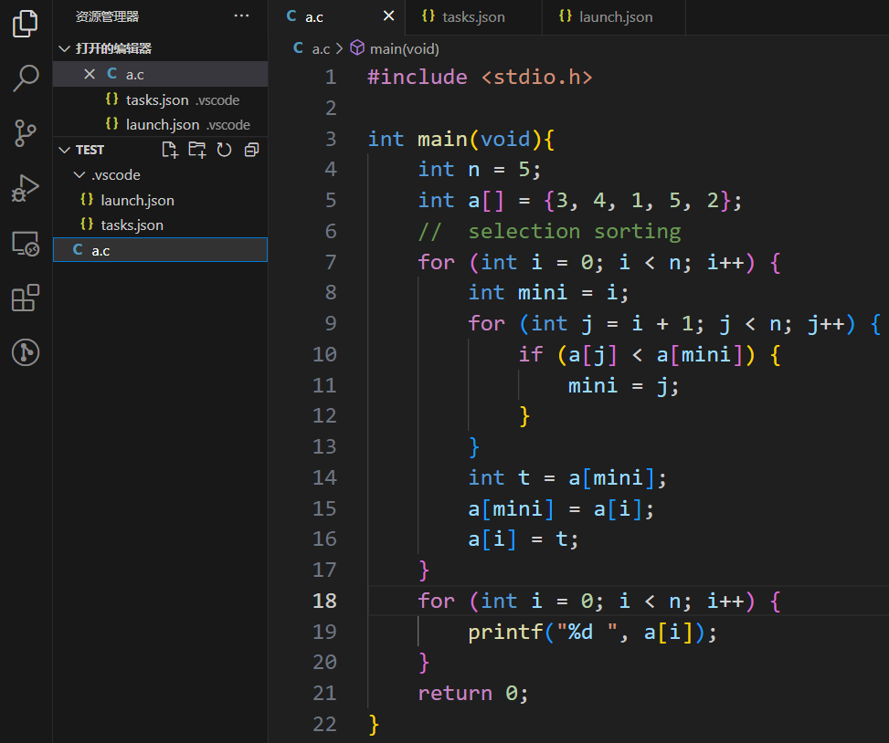
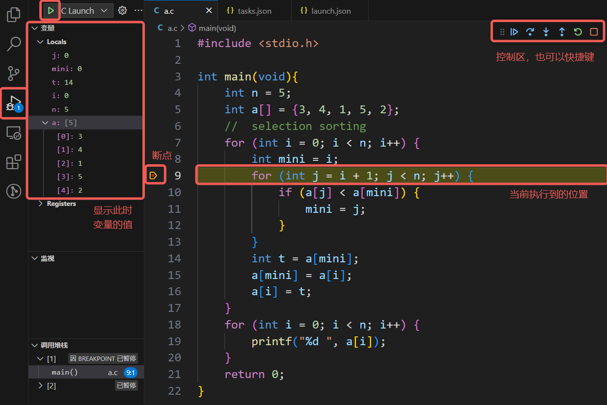

# 动态跟踪

## printf 大法
> printf 大法不专指 `printf`，在 C 中也可以是 `puts` 等输出函数，又或许是 C++ 的 `cout`、Python 的 `print`、Java 的 `System.out.println`，甚至是打日志

printf 大法的强大之处在于它可以在程序的各种位置灵活输出你所关心的变量值，开发人员通过 printf 侧面剖析程序的运行情况，从而确定问题症结。在业界应用中，printf 大法甚至可以让上线的代码继续维持运行，只是在关键节点打印信息以检查错误，减少服务下线带来的损失。

在这里介绍一下我本人应用 printf 的框架：

- 定位问题发生的区域
- 定位异常变量
- 定位问题发生的代码

例如程序陷入了死循环，那么可以

- 定位问题发生的区域：各个循环前后设置 printf，根据输出初步判断在哪个循环发生了死循环
- 定位异常变量：关注这个死循环，打印你所关心的几个变量，看看哪个变量和预期结果不符
- 定位问题发生的代码：静态思考，或者在循环内部代码级设置 printf，定位哪一句发生了问题
- 如果一句代码中做了很多事，那么可以拆分这句代码进行更细粒度的分析

因此建议**不要压行**，一句代码不必做太多事情，否则不仅阅读有困难，调试也会比较麻烦。

## VSCode 配置调试

可以参考 [GZTime 的教程](https://blog.gztime.cc/posts/2020/6b9b4626/#%E9%85%8D%E7%BD%AE%E6%AD%A5%E9%AA%A4)，从 1.3.3 开始跟着配置。注意一下按照这个教程需要按照其要求的文件组织形式工作，并且不管 C/C++ 程序都会使用 g++ 编译。比较熟练的同学可以通过自行修改 `tasks.json` 和 `launch.json` 进行自己的配置。

!!! info "希望快速上手的同学可以按接下来的引导配置，面向单文件编译，编译产生的可执行程序与源代码在同一目录下"

在工作目录的 `.vscode` 文件夹下创建 `tasks.json` 和 `launch.json` 文件。`tasks.json` 的内容为
```json
{
    // See https://go.microsoft.com/fwlink/?LinkId=733558
    // for the documentation about the tasks.json format
    "version": "2.0.0",
    "tasks": [
        {
            "label": "C build",
            "type": "shell",
            "command": "gcc",
            "args": [
                "${file}",
                "-o", 
                "${fileDirname}/${fileBasenameNoExtension}",
                "-g", // 生成和调试有关的信息
                "-Wall", // 开启额外警告
                "-std=gnu11" // 使用 c11 标准，或根据自己的需要进行修改
            ],
            "group": "build",
            "presentation": {
                // Reveal the output only if unrecognized errors occur.
                "reveal": "silent"
            },
            // Use the standard MS compiler pattern to detect errors, warnings and infos
            "problemMatcher": "$msCompile"
        }
    ]
}
```

`launch.json` 的内容为
```json
{
    // 使用 IntelliSense 了解相关属性。
    // 悬停以查看现有属性的描述。
    // 欲了解更多信息，请访问: https://go.microsoft.com/fwlink/?linkid=830387
    "version": "0.2.0",
    "configurations": [
        {
            "name": "C Launch", // 启动项的名称
            "type": "cppdbg",
            "request": "launch",
            "targetArchitecture": "x64",
            "program": "${fileDirname}/${fileBasenameNoExtension}.exe", // 运行文件的路径
            "args": [], // 运行文件的参数，一般没有
            "stopAtEntry": false, // 是否在入口点处暂停
            "cwd": "${fileDirname}",
            "environment": [],
            "externalConsole": false,
            "internalConsoleOptions": "neverOpen",
            "MIMode": "gdb",
            "miDebuggerPath": "C:/TDM-GCC-64/bin/gdb64.exe", // DEBUG 程序的路径
            "setupCommands": [
                {
                    "description": "Enable pretty-printing for gdb",
                    "text": "-enable-pretty-printing",
                    "ignoreFailures": false
                }
            ],
            "preLaunchTask": "C build" // 运行前需要完成的任务
        },
    ]
}
```

!!! info "注意 `launch.json` 中的 `miDebuggerPath` 项是 gdb 的路径，对于未使用 WSL、按默认目录安装了 tdm-gcc 的 Windows 用户来说不需要修改，但是其他情况（tdm-gcc 不默认安装、使用 WSL 或 Mac 用户）下需要确认自己的 gdb 路径并进行修改。"

创建源代码文件 `a.c`，如下图所示：



最左侧栏切换到运行和调试，在第 9 行打上断点，选择 `C Launch` 就可以开始调试。

!!! info "注意运行“C Launch”之前需要在编辑器选中想要编译的 C 文件，它会默认编译调试你当前的文件"



控制区从左到右为

- 运行 (F5)：持续运行，直到遇到断点或者程序结束
- 单步跳过 (F10)：运行到下一行代码，即使这一行调用了函数也不会看到其中的执行细节
- 单步步入 (F11)：执行这一步代码，如果这一步调用了函数则会进入函数内部
- 单步跳出 (F12)：跳出这个函数
- 重启 (Ctrl+Shift+F5)：从头开始重新调试
- 停止 (Shift+F5)：停止调试

## GDB 使用基础（可选）

!!! info "GDB 对零基础的同学可能不太友好，可以跳过，比较熟练的同学可以考虑上手"

> GDB 相关内容参考了 [2022 秋操作系统原理与实践实验文档](https://zju-sec.github.io/os22fall-stu/)（已失效）

### 什么是 GDB

GDB，全称 GNU Debugger，是一个功能强大的程序调试器。借助 GDB 等调试器，我们能够查看另一个程序在执行时实际在做什么（比如访问哪些内存、寄存器），在其他程序崩溃的时候可以比较快速地了解导致程序崩溃的原因。

GDB 可以进行本地调试 (native debug) 或远程调试 (remote debug)：

- 本地调试：被调试的程序可以和 GDB 运行在同一台机器上，并由 GDB 控制
- 远程调试：被调试的程序只和 gdb-server 运行在同一台机器上，由连接着 gdb-server 的 GDB 进行控制

!!! info "GDB 由 GNU 开源组织发布，工作于类 Unix 操作系统。希望直接使用 GDB 的同学，如果是 Mac 主力机没有问题，Windows 主力机则建议使用 WSL。"

GDB 的功能十分强大，我们经常在调试中用到的有:

- 启动程序，并指定可能影响其行为的所有内容
- 使程序在指定条件下停止
- 检查程序停止时发生了什么
- 更改程序中的内容，以便纠正一个 bug 的影响

### GDB 基本命令介绍

- `(gdb) layout asm`: 显示汇编代码
- `(gdb) start`: 单步执行，运行程序，停在第一执行语句
- `(gdb) continue`: 从断点后继续执行，简写 `c`
- `(gdb) next`: 单步调试（逐过程，函数直接执行），简写 `n`
- `(gdb) step instruction`: 执行单条指令，简写 `si`
- `(gdb) run`: 重新开始运行文件（run-text：加载文本文件，run-bin：加载二进制文件），简写 `r`
- `(gdb) backtrace`：查看函数的调用的栈帧和层级关系，简写 `bt`
- `(gdb) break` 设置断点，简写 `b`
    - 断在 `foo` 函数：`b foo`
    - 断在某地址: `b * 0x80200000`
- `(gdb) finish`: 结束当前函数，返回到函数调用点
- `(gdb) frame`: 切换函数的栈帧，简写 `f`
- `(gdb) print`: 打印值及地址，简写 `p`
- `(gdb) info`: 查看函数内部局部变量的数值，简写 `i`
    - 查看寄存器 ra 的值: `i r ra`
- `(gdb) display`: 追踪查看具体变量值
- `(gdb) x/4x <addr>`: 以 16 进制打印 `<addr>` 处开始的 16 Bytes 内容

更多命令可以参考[100个gdb小技巧](https://wizardforcel.gitbooks.io/100-gdb-tips/content/)

### GDB 安装指南

=== "Windows"
    tdm-gcc 自带 gdb（除非安装选项中没选），MinGW 的 gcc 也一般都有自带

=== "WSL"
    对于 Ubuntu，直接执行
    ```
    sudo apt install gdb
    ```

=== "macOS"
    首先安装 Homebrew，参见 [brew.sh](https://brew.sh/)。随后按照[在 macOS 上安装 GDB](https://www.ics.uci.edu/~pattis/common/handouts/macmingweclipse/allexperimental/mac-gdb-install.html) 安装即可。