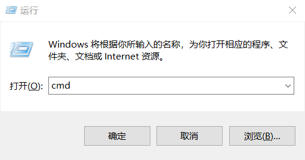
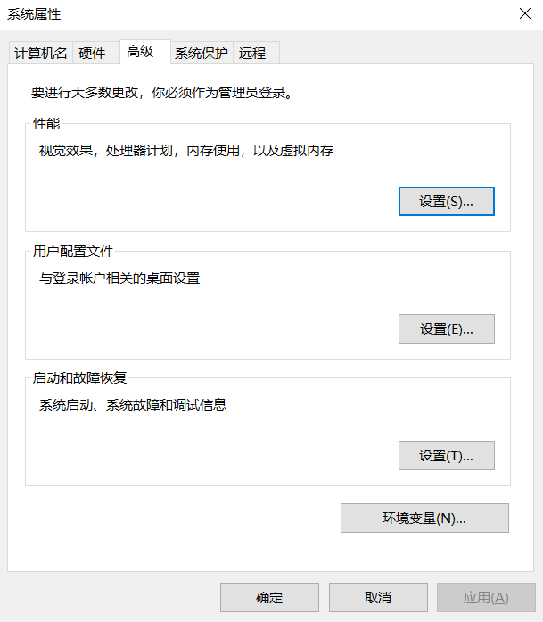

# 安装 C 语言编译器

!!! info "本篇相对比较复杂，如果在本篇配置遇到难以解决的困难，而作业/实验截止日期快要到了，可以跳过本篇参考 [下一篇](local_env.md) 安装 `Dev-C++` 进行临时开发。"

写完了 C 语言代码，我们需要让它变成能跑的程序，这就需要准备 C 语言的编译器支持。以下主要介绍 `Windows` 系统的配置。

### 1. 决定就是你了，gcc！

> 大部分零基础的同学使用的可能都是 `Windows` 系统，那么初学的情况下我们只需要知道我们即将安装的 C 语言编译器就是 `gcc` 就行了。

`gcc` 本是面向 `Linux` 的，我们想要在 `Windows` 系统上使用，一般得依赖 `MinGW` 的 `gcc`，`tdm-gcc` 也是基于 `MinGW` 的 `gcc` 来的。

!!! info "有能力的同学推荐在 `Windows` 上开启 `wsl`，使用 `wsl` 进行 `C` 语言开发。`wsl` 可以理解为在 `Windows` 的电脑中模拟一个 `Linux` 的小系统，从而能方便地控制环境。相关的教程可以自己搜索。"

### 2. Windows 小白教程之 TDM-GCC

> 前面选择了 `wsl` 的同学这一节不用看了，自己努力吧，然后再看 [第 3 节](#3-gcc)。`Mac` 用户可以直接看 [第 3 节](#3-gcc)。

可以按照老师的视频教程下载 [TDM-GCC](https://jmeubank.github.io/tdm-gcc/download/)，目前最新版为 `GCC 10.3.0`。

桌面找到 `此电脑`，右键属性，可以看到是 64 位系统还是 32 位系统（现在一般都是 64 位系统）。64 位系统直接下载 `tdm64-gcc-10.3.0-2.exe` 安装即可，32 位则选择 `tdm-gcc-10.3.0.exe`。

同样考虑自定义安装选项：

- 自定义目录
    - 默认 C 盘也挺不错
- 可选的安装项
    - 可以全选。如果确定不需要一些东西可以不选，比如确定自己不会再需要调试 32 位程序的话可以不选 `gdb32`
- `Start Menu items`
    - 看个人意愿，可以不选
- `Add to PATH`
    - **建议选上**。如果不选或者忘选了，将会需要自己配置 tdm-gcc 的环境变量路径。

> P.S. 如果希望用更新版本的 `gcc` 可以使用 [winlibs 编译的 mingw-gcc](https://winlibs.com/)，或者按 [b 站视频](https://www.bilibili.com/video/BV19c411G7ey/?p=3) 来，又或许你可以自己选择。

### 3. 测试 gcc 是否正确安装

=== "Windows"
    Win + R 键打开如下界面，输入 `cmd` 后回车

    
    
    出现的界面中输入 `gcc`，应当出现如下信息：
    ```
    gcc: fatal error: no input files
    compilation terminated.
    ```
    
    如果没有，可能是你还没有安装 `gcc`，或者你前一步 `Add to PATH` 没有正常进行，可能需要参照 [Windows 修改环境变量](#4-windows) 进行环境变量的检查。
    
    出现的界面中输入 `gcc --version`，应当出现类似如下的信息。
    ```
    gcc.exe (tdm64-1) 9.2.0
    Copyright (C) 2019 Free Software Foundation, Inc.
    This is free software; see the source for copying conditions.  There is NO
    warranty; not even for MERCHANTABILITY or FITNESS FOR A PARTICULAR PURPOSE.
    ```
    
    我的显示是 `GCC 9.2.0`，是因为装了旧版本的 `TDM-GCC`，你们的显示将会是 `gcc version 10.3.0`。

=== "Wsl"
    终端中输入 `gcc`，应当出现如下信息：
    ```
    gcc: fatal error: no input files
    compilation terminated.
    ```

    终端中输入 `gcc --version`，可能会出现类似如下的信息：
    ```
    gcc (Ubuntu 11.2.0-19ubuntu1) 11.2.0
    Copyright (C) 2021 Free Software Foundation, Inc.
    This is free software; see the source for copying conditions.  There is NO
    warranty; not even for MERCHANTABILITY or FITNESS FOR A PARTICULAR PURPOSE.
    ```

=== "Mac"
    Mac 用户直接使用 `gcc -v` （或者 `xcode-select --install`）会提示你安装开发者工具，然后就会帮你安装 `XCode` 在内的一系列奇怪的东西，最后告诉你你安装的 `gcc` 其实是 `clang`，本质上是它把 `clang` 叫做 `gcc` 了。

    成功安装后，终端输入 `gcc` 会出现如下信息：
    ```
    clang: error: no input files
    ```
    
    使用 `gcc --version` 可能出现以下信息：
    ```
    Apple clang version 14.0.3 (clang-1403.0.22.14.1)
    Target: x86_64-apple-darwin22.6.0
    Thread model: posix
    InstalledDir: /Library/Developer/CommandLineTools/usr/bin
    ```
    
    `clang` 也是一种 C 语言编译器，只是很多方面和 `gcc` 会有差异。使用 `clang` 同样也能完成 Hello World 的编译运行，只是我本人并非 `Mac` 的熟练用户，因此不太清楚比较复杂的程序在后续是否会出现问题。以 Mac 作为主力机的同学可能要更加自力更生一些了。
### 4. Windows 修改环境变量

> Windows 用户环境变量配置出现问题了才需要看这一小节

检查一下环境变量，Win + R 键输入 `sysdm.cpl` 后回车，会出现 “系统属性” 界面，选择 “高级”，如下图所示：



打开环境变量，在 “系统变量” 或者 “用户变量” 中找到 `PATH` 变量，在其中增加一项 `TDM-GCC` 的路径。例如你如果默认安装 `TDM-GCC`，那么路径可能就是 `C:\TDM-GCC-64\bin`。