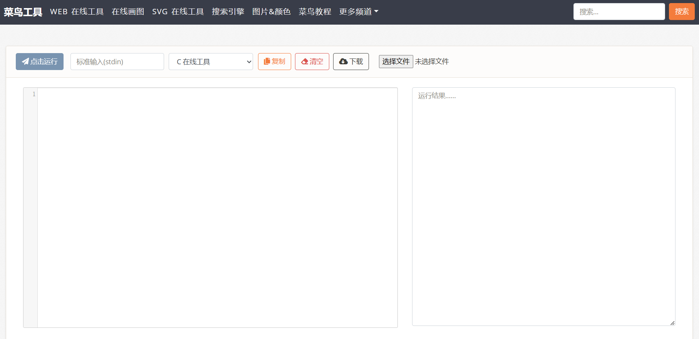
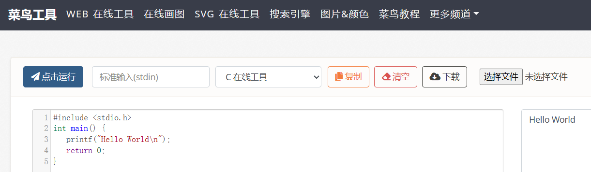

# 第一个 C 语言程序

## Hello World

下面的程序就是经典的 Hello World，其运行效果是在终端输出 `Hello World`，或者你可以暂且理解为在屏幕上显示 `Hello World`。
``` C
#include <stdio.h>
int main() {
   printf("Hello World\n");
   return 0;
}
```

> P.S. `printf` 是 `<stdio.h>` 中的一个函数，可以将其拆开成 `print` 和 `f` 看代。`print` 是取自打印机打印字体的意思，`f` 则是格式 `format` 的缩写，因此 `printf` 的意思就是输出格式化字符串。

## C 语言在线运行环境体验

在完成本地 C 语言运行环境的配置之前，我们可以先在一些 C 语言在线运行环境进行体验。但是，**C 语言在线运行环境经常会出现错误的运行结果**，**需要尽早完成本地 C 语言运行环境的配置**。

可以先用 [C 在线工具 | 菜鸟工具](https://c.runoob.com/compile/11/) 进行 C 语言程序的体验。进入之后点击清空，可以看到如下界面：



将上面的代码输入到左边的框中，然后点击 `点击运行` 按钮，就可以得到运行结果：



## 常见代码错误

如果你想要自己打一遍这个程序，那么请注意不要出现以下错误：

- 专用名称打错，包括
    - `main` 打成了 `mian`
    - `printf` 打成了 `print`
    - ...
- 英文符号打成了中文符号，包括
    - `;` 打成 `；`
    - `""` 打成 `“”`
    - `()` 打成 `（）`
    - ...
- 句末没有加 `;`
- ...

这些是很容易发生的低级错误，很多时候比较熟悉 C 语言的人也会马失前蹄打错，初学时需要关注一下。