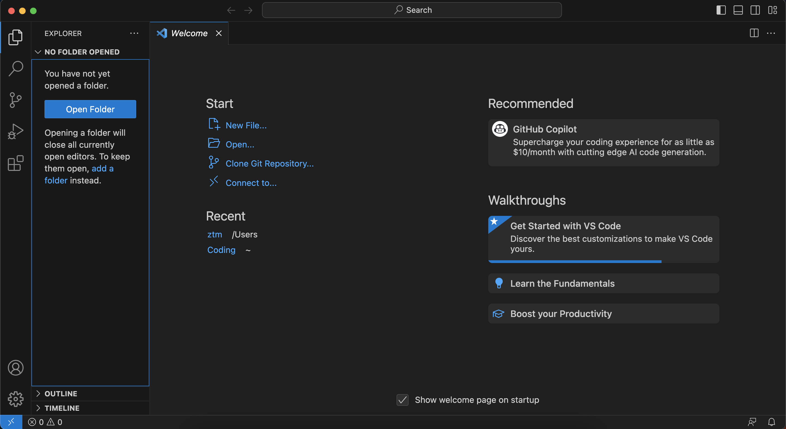
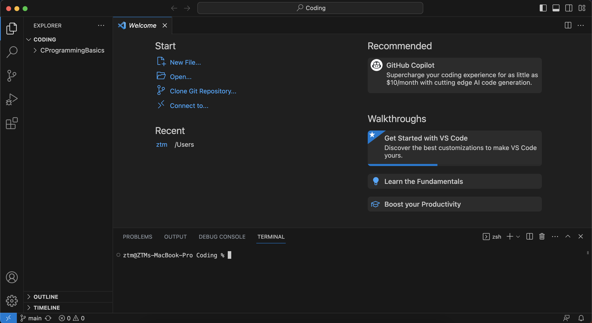

# VSCode 安装与配置

> VSCode 的全称是 Visual Studio Code，注意它和 Visual Studio 完全是两个东西

!!! warning "**不建议**安装 Visual Studio，除非你清楚你安装它是为了什么"

在这里仅介绍 Visual Studio Code 的安装。除了老师的视频之外，大家安装配置时还可以参考 [GZTime 的教程](https://blog.gztime.cc/posts/2020/6b9b4626/)，对于初学者来说还不错。

## 安装

VSCode 直接从[官网](https://code.visualstudio.com/)选择自己平台对应的安装包下载就行

=== "Windows"
    Windows 的 exe 安装**可以全选默认选项一路 Next**，比较熟悉的同学可以自定义选项：
    

    - 安装目录
        - 推荐默认 C 盘，可能运行速度更快，也可以避免一些权限问题
    - 将 “通过 Code 打开” 操作添加到 Windows 资源管理器文件/目录上下文菜单
        - 选中该项后，选中文件或者文件夹，右键菜单中会出现 `通过 Code 打开` 的选项
        - 如果希望右键菜单不那么臃肿的话可以不选这一项
        - 本人没有选择该选项，可以自行思考选择
    - 将 Code 注册为受支持的文件类型的编辑器（推荐）
        - 打开受支持的文件类型时，VSCode 将会成为可选项
    - 添加到 PATH（推荐）
        - 在命令行窗口/终端可以用 `code` 命令打开 VSCode

=== "Mac"
    Mac 的包下载下来之后拖入 `Application` 文件夹可以直接运行

    - 添加到 PATH：如果需要在命令行窗口/终端用 `code` 命令打开 VSCode，那么需要进行如下操作
        - 打开 VSCode 界面
        - 使用 Shift + Command + P 打开命令面板
        - 输入 `shell command`，找到 Shell Command: Install ‘code’ command in PATH 进行执行

## 插件安装

### 推荐的插件

打开 VSCode 后，在左侧竖栏寻找下面这个图标：

<div style="text-align:center;">

</div>

点击这个图标就进入了插件管理。建议可以安装下面两个插件：

- C/C++: 微软自家的插件，可用于**语法识别、代码高亮**

<div style="text-align:center;">

</div>

- Code Runner: 能够使用**按键编译**运行程序，而不需要自己向终端输入命令

<div style="text-align:center;">

</div>

### 汉化（可选）

> 英语基础不太好的同学有困难可以使用，英语基础比较好以及想要在日常实践中学习英语的同学建议跳过这一步。

如果对英语不太熟悉，需要 VSCode 界面汉化，可以在插件中搜索 `Chinese` 安装如下插件：

<div style="text-align:center;">

</div>

## VSCode 使用的一个简单示例

复杂的配置与使用大家可以参考 [GZTime 的教程](https://blog.gztime.cc/posts/2020/6b9b4626/)，这里为想要尽快上手的同学提供一个简单的使用示例。

打开 VSCode（打开时没有指定工作目录），将会出现如下的窗口：



点击左侧的 `Open Folder`，选择一个目录作为你的工作目录，一般会把你这个窗口所要处理的所有文件放置在这里。注意到这里出现了一个 `TERMINAL`，这是通过顶栏的 Terminal > New Terminal（或者终端 > 新建终端）打开的。这个 `TERMINAL` 的功能大致与命令提示符/终端相同。



按 `New File` 键可以新建文件，旁边有新建文件夹按键。当然，直接在左侧工作目录右键也可以新建文件/文件夹。

<div style="text-align:center;">

</div>

创建 `test.c`，输入 Hello World 的代码并**保存文件**。然后在终端执行
```
gcc test.c
```

在不同的系统将会生成不同的编译产物。

=== "Windows"
    将会生成 `a.exe`，随后执行
    ```
    ./a.exe
    ```

=== "WSL/macOS"
    将会生成 `a.out`，随后执行
    ```
    ./a.out
    ```

以下展示在 macOS 上的执行结果：


这里有几个注意点：

- 记得保存文件后再 gcc 编译，可以考虑开启自动保存（参考 [GZTime 的教程](https://blog.gztime.cc/posts/2020/6b9b4626/)）
- 建议工作目录和文件名全英文，给出以下几个**反面案例**：
    - 文件名 `作业.c`
    - 工作目录 `编程`
    - 工作目录叫 `Coding`，但是绝对路径是 `D:/学习资料/Coding`
- 可以指定编译生成的文件名，比如你想要输出文件名为 `hello.exe`，就可以执行
```
gcc test.c -o hello.exe
```
- 更多的 gcc 选项和 VSCode 扩展功能留待你们探索