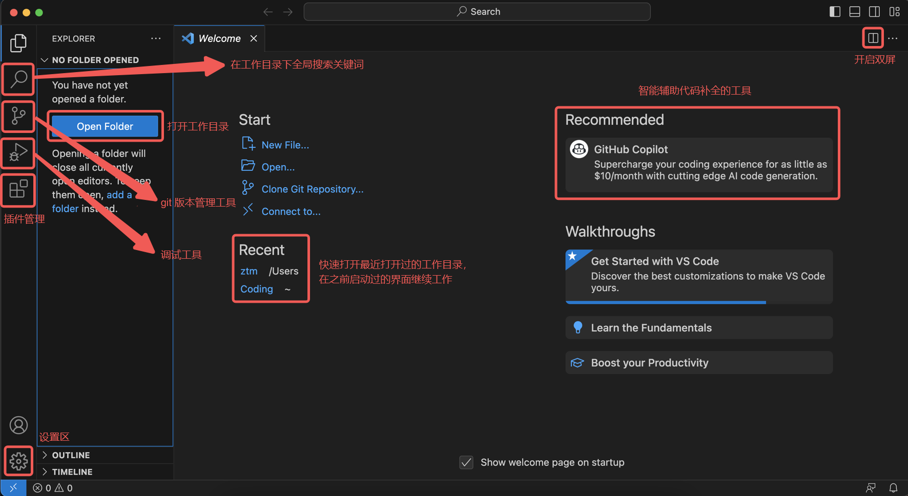
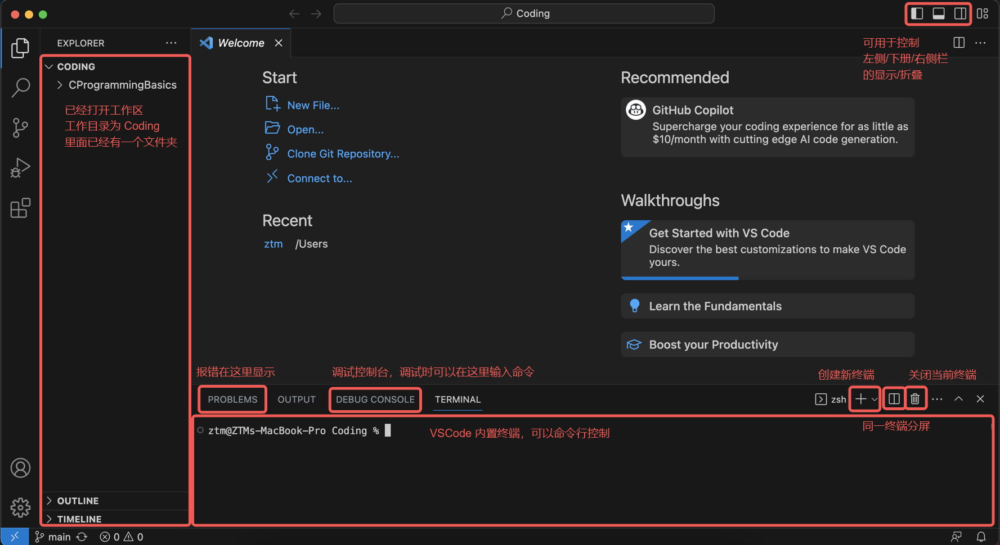

# VSCode 安装与配置

> VSCode 的全称是 Visual Studio Code，注意它和 Visual Studio 完全是两个东西

!!! warning "**不建议**安装 Visual Studio，除非你清楚你安装它是为了什么"

在这里仅介绍 Visual Studio Code 的安装。除了老师的视频之外，大家安装配置时还可以参考 [GZTime 的教程](https://blog.gztime.cc/posts/2020/6b9b4626/)，对于初学者来说还不错。

## 安装

VSCode 直接从[官网](https://code.visualstudio.com/)选择自己平台对应的安装包下载就行

=== "Windows"
    Windows 的 exe 安装可以全选默认选项一路 Next，比较熟悉的同学可以自定义选项：

    - 安装目录
        - 推荐默认 C 盘，可能运行速度更快，也可以避免一些权限问题
    - 将 “通过 Code 打开” 操作添加到 Windows 资源管理器文件/目录上下文菜单
        - 选中该项后，选中文件或者文件夹，右键菜单中会出现 `通过 Code 打开` 的选项
        - 如果希望右键菜单不那么臃肿的话可以不选这一项
        - 本人没有选择该选项，可以自行思考选择
    - 将 Code 注册为受支持的文件类型的编辑器（推荐）
        - 打开受支持的文件类型时，VSCode 将会成为可选项
    - 添加到 PATH（推荐）
        - 在命令行窗口/终端可以用 `code` 命令打开 VSCode

=== "Mac"
    Mac 的包下载下来之后拖入 `Application` 文件夹可以直接运行

    - 添加到 PATH：如果需要在命令行窗口/终端用 `code` 命令打开 VSCode，那么需要如下操作
        - 打开 VSCode 界面
        - 使用 Shift + Command + P 打开命令面板
        - 输入 `shell command`，选择 `Shell Command: Install ‘code’ command in PATH` 回车执行

## 插件安装

打开 VSCode 后，在左侧竖栏寻找下面这个图标：

<div style="text-align:center;">

</div>

点击这个图标就进入了插件管理。建议可以安装下面两个插件：

- C/C++: 微软自家的插件，可用于**语法识别、代码高亮**

<div style="text-align:center;">

</div>

- Chinese(Simplified): 界面汉化插件（可选）

<div style="text-align:center;">

</div>

> 英语基础不太好的同学有困难可以使用，英语基础比较好以及想要在日常实践中学习英语的同学建议跳过这一步。

!!! info "这里只提供最基本的插件和使用示例，复杂的配置与使用大家可以参考 [GZTime 的教程](https://blog.gztime.cc/posts/2020/6b9b4626/)"

## VSCode 使用的一个简单示例

这里为想要尽快上手的同学提供一个简单的使用示例。打开 VSCode（打开时没有指定工作目录），将会出现如下的窗口：



点击左侧的 `Open Folder`，选择一个目录作为你的工作目录，一般会把你这个窗口所要处理的所有文件放置在这里。顶栏 Terminal > New Terminal（或终端 > 新建终端）打开 VSCode 的内部终端，功能大致与命令提示符/终端相同。


下图就是打开了工作目录并新建了终端的界面状态。



鼠标移动到工作区，按 `New File` 键可以新建文件，旁边有新建文件夹按键。当然，直接在左侧工作目录右键也可以新建文件/文件夹。

<div style="text-align:center;">

</div>

创建 `test.c`，输入 Hello World 的代码并**保存文件**。然后在终端输入以下命令并执行：
```
gcc test.c
```

在不同的系统将会生成不同的编译产物。

=== "Windows"
    将会在和 `test.c` 同目录下生成 `a.exe`，随后执行
    ```
    ./a.exe
    ```

=== "WSL/macOS"
    将会在和 `test.c` 同目录下生成 `a.out`，随后执行
    ```
    ./a.out
    ```

以下展示在 macOS 上的执行结果：


这里有几个注意点：

- 记得保存文件后再 gcc 编译，可以考虑开启自动保存
    - 如下图所示，找到左下角的齿轮点击后选择 Setting 或者设置，出现的设置页面中搜索 `auto` 可以找到如图所示的 `Auto Save` 设置项，设置为 afterDelay 即可
    - afterDelay 是对文件做出修改就实时保存，如果嫌保存频率过高可以选择 onFocusChange 或者 onWindowsChange
    - 我本人使用的是 onFocusChange，这样移动到终端准备编译运行时源代码文件就会自动保存，既自动保存又不会保存太频繁


- 建议工作目录和文件名全英文，给出以下几个**反面案例**：
    - 文件名 `作业.c`
    - 工作目录 `编程`
    - 工作目录叫 `Coding`，但是绝对路径是 `D:/学习资料/Coding`
- 可以指定编译生成的文件名，比如你想要输出文件名为 `hello.exe`，就可以执行
```
gcc test.c -o hello.exe
```
- 更多的 gcc 选项和 VSCode 扩展功能留待你们探索

## VSCode + WSL（可选）
> 前面选择安装了 WSL 的使用 Windows 主力机的同学可以参考一下，非常有用的功能

以下引导主要按照 [Microsoft 的官方文档](https://learn.microsoft.com/en-us/windows/wsl/tutorials/wsl-vscode)，也可以参考其[中文版](https://learn.microsoft.com/zh-cn/windows/wsl/tutorials/wsl-vscode)。

### 从 VSCode 连接到 WSL

安装 WSL 插件，如下图所示：

<div style="text-align:center;">

</div>

或者你也可以像官方文档那样，直接安装整个 Remote Development 扩展包：

<div style="text-align:center;">

</div>

其中不仅有 WSL，还包括另外三个非常有用的远程开发插件。


- Ctrl + Shift + P，在出现的命令框中输入 WSL，选择 `WSL: Connect to WSL in New Window`（或 `WSL: 在新窗口中连接到 WSL`）
- 将打开一个新的 VSCode 窗口，里面已经连接到默认的 WSL 环境

> 如果需要在本窗口连接到 WSL，或连接到非默认的 WSL 所安装的其他 Linux 发行版，可以选择其他 WSL 的命令


注意上图左下角所显示的状态，表明已经连接到 WSL 所安装的 Ubuntu-22.04，接下来的开发操作和[上一节](#vscode_1)就区别不大了。

### 从 WSL 启动 VSCode

**确保你已经将 VSCode 添加到 PATH 环境变量中**。如果已经添加，那么直接在 WSL 的命令行中你所希望作为工作目录的位置执行
```
code .
```

就可以打开 VSCode，连接到 WSL 并且打开该目录作为工作目录。`.` 在这里表示当前目录即 `pwd`，如果将它替换成其他目录的路径也是可以将其打开作为工作目录的。

如果你还未将 VSCode 添加到 PATH 环境变量中，那该功能将无法使用，需要你手动添加 VSCode 到 PATH 环境变量。例如你的 Windows 用户名是 ZTM，并把 VSCode 安装在默认目录，那么需要将 `C:\Users\ZTM\AppData\Local\Programs\Microsoft VS Code\bin` 加入到 PATH 环境变量，参考 [Windows 修改环境变量](../C_compiler/#windows)。
