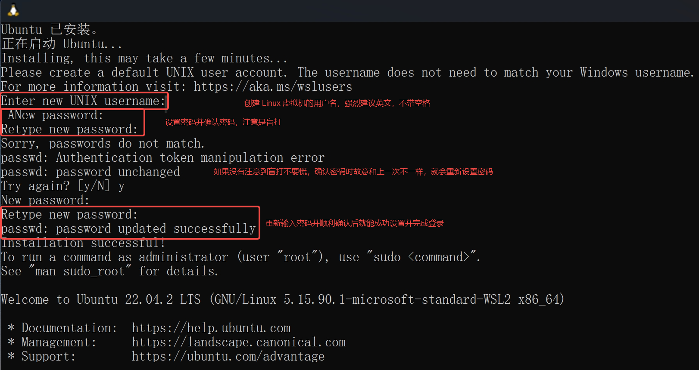

# Windows 使用拾遗

!!! info "Mac 用户和已经对 Windows Terminal 和 WSL 比较熟练的同学可以跳过这一节"

## 运行与终端

使用 Win + R 组合键，将会出现如下窗口：

<div style="text-align:center;">

</div>

这就是运行窗口，可以在其中输入命令运行，即使是 Windows XP 都可以使用。例如在其中输入 `cmd` 后回车，就会出现**命令提示符**，如下图所示

<div style="text-align:center;">

</div>

但是命令提示符功能有限，也不是很美观，推荐安装 **Windows Terminal**（终端）。在 Microsoft Store 中搜索 terminal，出现如下的选项，然后选择安装即可。

<div style="text-align:center;">

</div>

在比较新版本的 Windows 中，Win 键打开菜单之后输入字符能够搜索到对应程序，除了常用的应用程序以外，启动 cmd.exe 和 sysdm.cpl 也可以这样进行，效果和 Win + R 相同。

## WSL 安装简单引导（可选）

> 推荐装一装，如果主力机是 Windows 在以后将对 WSL 有较大需求

WSL，全称 Windows Subsystem for Linux（适用于 Linux 的 Windows 子系统），是一项允许开发者不依靠单独的虚拟机或双启动 (dual booting) 而在 Windows 上运行 Linux 环境的功能。

### 安装：以 Ubuntu 为例

在这里以在 Windows11 上安装 WSL2 Ubuntu 为例介绍最简单的安装流程，详细的信息可以参考[官方文档 Install Linux on Windows with WSL](https://learn.microsoft.com/en-us/windows/wsl/install) 或者它的[中文版](https://learn.microsoft.com/zh-cn/windows/wsl/install)。

> Ubuntu 是 Linux 的一种发行版本，在这里就不对 Linux 的众多发行版本进行介绍和评价了。有能力和想法的同学可以自己对照教程安装其他发行版，比如在终端输入 `wsl --list --online` 可以看到所有可以选择的 Linux 发行版

注意安装 WSL 的先决条件：Windows 版本**不低于** Windows 10 20H2（Build 19042）或者 Windows 11。如果版本太老，请更新到最新版本，如果无法更新可以考虑重装系统。

!!! info "可以使用 `winver` 命令查询 Windows 版本，Win + R 输入 `winver` 或者在 Win 键出现的菜单栏中直接输入 `winver` 都可以启动。新买的电脑可能 Windows 11 居多，如果是 Windows 10 的电脑版本显示可能是 21H2（操作系统内部版本 19044.3086），这样也是符合先决条件的。"

直接使用如下命令自动安装：

```
wsl --install
```

中途可能会弹出两个窗口，显示正在修改什么东西，统统选择“是”。安装完成后，将出现如下界面



- 设置一个用户名，建议全英文无空格
    - 若有空格，将会只取第一个空格前面的内容作为你的用户名
- 输入密码，注意你输入的字符不会在屏幕上显示，需要盲打
    - 如果打了乱七八糟的字符不要慌，确认密码时故意打错会重新让你设置密码
    - 确认密码与输入密码一致才会设置成功

这样就完成了 WSL2 Ubuntu 的安装。

### 简单的设置

> 上面已经完成了安装，这里是为了方便未来的使用而进行的一些说明

Linux 的发行版本默认安装在 C 盘，推荐将其导出到其他数据盘，避免占用 C 盘太多空间。例如完成了 Ubuntu 的安装，可以在 D 盘建立目录 `D:\wsl\ubuntu`（按个人喜好定义目录），随后在命令提示符/终端执行：
```
wsl --export Ubuntu D:\wsl\ubuntu\ubuntu.tar
```

将导出 ubuntu.tar，随后进行注销：
```
wsl --unregister Ubuntu
```

最后重新导入。
```
wsl --import Ubuntu D:\wsl\ubuntu D:\wsl\ubuntu\ubuntu.tar
```

以上操作完成后，登录 Ubuntu 将会默认以 root 用户打开。但是 root 用户具有最高权限，胡乱操作容易出问题，以及 root 用户的颜色是白色的，不是特别好看，因此可以修改默认的登录用户。首先**在 WSL 外**输入以下指令以停止 WSL：

> 如果不知道 WSL 外是什么意思，参考[“WSL 外” 和 “WSL 内”](../../faq/#wsl-wsl)

```
wsl --shutdown
```

然后对 Ubuntu 进行默认用户配置的修改，假设你设定的用户名为 zhou：
```
Ubuntu config --default-user zhou
```

使用终端的一大好处是方便打开 WSL。如下图所示，点击 Ubuntu 22.04.2 LTS 或者使用 Ctrl + Shift + 5 组合键就可以方便地打开 Ubuntu 22.04。当然这是因为我安装的是 `Ubuntu 22.04` 的缘故，在你们的电脑中显示的应该就是 `Ubuntu`。

<div style="text-align:center;">

</div>

其他 WSL 的使用方法留待你们慢慢探索了，在此不再赘述。