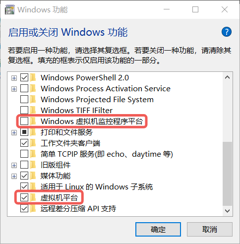
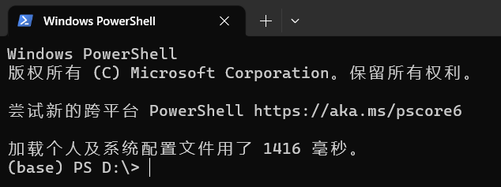
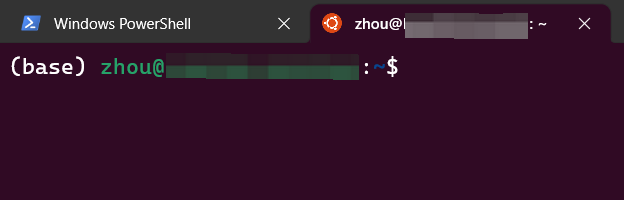
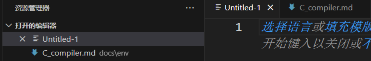
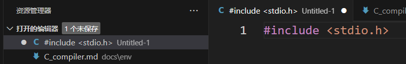
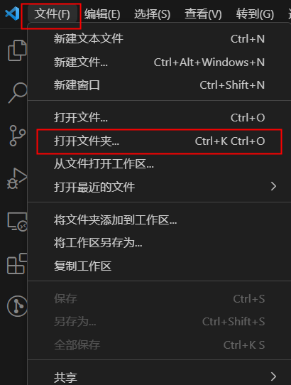
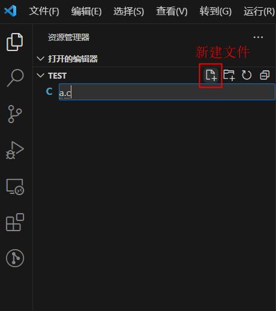
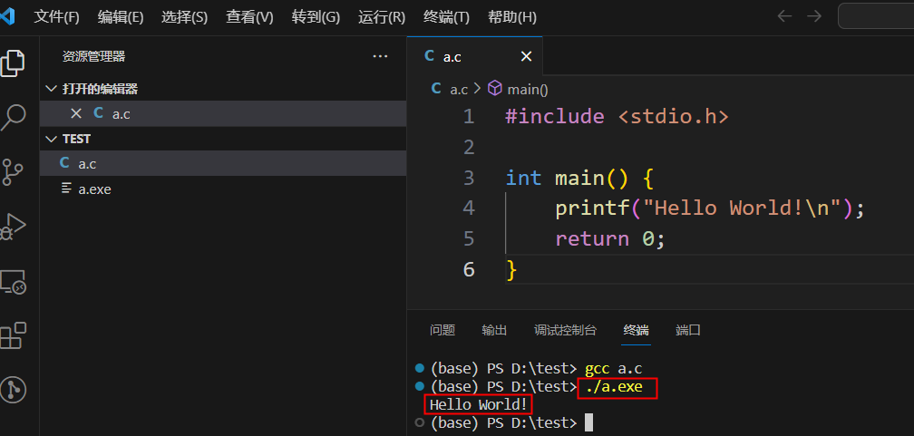

# FAQ(Frequently Asked Questions)

在这里提供一些经常被问到的问题，遇到问题时可以首先在这里查找是否已经有解决方案

## 必须了解的内容

- Windows 的截图快捷键是 Windows+Shift+S，请务必截屏不要拍照
- 路径全英文，即包含代码文件的文件夹、上一层文件夹、上上层文件夹……的名字都是英文

## gcc 是否安装成功？

在终端输入 `gcc` 后看见
```
gcc: 致命错误: 没有输入文件
```

这是正常的输出，只是 `gcc: fatal error: no input files` 的中文翻译而已。 

输入 `gcc--version` 后出现
```
‘gcc--version’ 不是内部或外部命令，也不是可运行的程序或批处理文件
```

只是你在 `gcc` 和 `--version` 中间少打了一个空格。

同理，如果你 `wsl--install` 无法执行，请关注一下你是不是少打了一个空格。

## WSL 安装报错

即报错 `WslRegisterDistribution failed with error`，目前已经出现如下几种错误编号

=== "0x800701bc"

    ```
    WslRegisterDistribution failed with error: 0x800701bc
    Error: 0x800701bc WSL 2 ?????????????????? https://aka.ms/wsl2kernel
    ```

=== "0x80370102"

    ```
    WslRegisterDistribution failed with error: 0x80370102
    Please enable the Virtual Machine Platform Windows feature and ensure virtualization is enabled in the BIOS.
    For information please visit https://aka.ms/enablevirtualization
    ```

=== "0x80370114"

    ```
    WslRegisterDistribution failed with error: 0x80370114
    Error: 0x80370114 ??????????????????
    ```

=== "0x80004002"

    ```
    WslRegisterDistribution failed with error: 0x80370114
    Error: 0x80370114 ??????????????????
    ```

=== "0x8007019e"

    ```
    WslRegisterDistribution failed with error: 0x80370114
    Error: 0x80370114 ??????? Linux ? Windows ???
    ```

建议使用 [bing](https://cn.bing.com)，把错误信息复制粘贴进行搜索，一般能找到解决方案。或者尝试这篇[解决 WSL2 的 0x800701bc 错误](https://zhuanlan.zhihu.com/p/599286889)，虽然你的错误编号可能不是这个，但是这篇文章给出的是旧版 WSL 的手动安装步骤，事实上来自[微软官方文档](https://learn.microsoft.com/zh-cn/windows/wsl/install-manual)，你也可以直接参考官方文档。

进行以上操作后，尝试在终端打开 Ubuntu，如果打开成功并让你注册用户名，则可以继续 WSL 安装。如果仍然不行，则尝试打开控制面板(Control Panel)-程序与功能(Programs and Features)-启用或关闭 Windows 功能（Turn Windows Features on or off），选上红框标注的两个功能：

- 虚拟机平台（Virtual Machine Platform）
- Windows 虚拟机监控程序平台（Windows Hypervisor Platform）

<div style="text-align:center;">
    
</div>

重启电脑，然后重新执行
```
wsl --set-default-version 2
```

然后再在终端打开 Ubuntu，观察是否能继续安装。

## “WSL 外” 和 “WSL 内”

以下窗口就是我所说的“WSL 外”，即 Windows 本机，不在其 Ubuntu 虚拟机中。

<div style="text-align:center;">
    
</div>

以下窗口则是“WSL 内”，即 Ubuntu 虚拟机中。

<div style="text-align:center;">
    
</div>

WSL 命令（例如 `wsl --shutdown`）只能在 WSL 外进行，在 WSL 内执行 WSL 命令就像大力士希望把自己举起来一样，是无法进行的。

## 未保存代码文件/命名诡异

但是一些同学写了代码后没有保存文件，文件名为 `Untitled-1` 或 `#include <stdio.h>`，如下图所示

<div style="text-align:center;">
    
</div>

<div style="text-align:center;">
    
</div>

请记得保存代码文件，否则在计算机看来就是没有任何代码！

文件命名请使用全英文，最好能表达这个代码文件的功能（强烈不建议叫 `Untitled-1`），并且加上 `.c` 的后缀名。

## Code Runner 报错

不推荐使用 Code Runner，因此不提供 Code Runner 报错的解决方案。推荐在终端（Windows Terminal 或者 VSCode 的内置终端都行）自己编译运行文件。

## gcc 编译后没有执行

例如代码文件为 `test.c`，使用 gcc 编译
```
gcc test.c
```

有同学表示输入了这个命令之后为什么没有提示输入或者进行输出，这是因为这条命令的作用是编译生成可执行文件 `a.exe`，接下来你想要真正实现功能需要执行它，即
```
./a.exe
```

## 我急着让代码跑起来

请耐心配置环境，至少[装完 gcc](../env/C_compiler/)。装完 gcc 后，在 D 盘创建空文件夹 test。

打开 VSCode，按以下步骤选择打开文件夹，打开空文件夹 test。



新建文件，命名为 `a.c`



在 `a.c` 中写代码，写完代码后终端-新建终端


在终端中输入 `gcc a.c`，回车，发现左侧生成了 `a.exe`（Windows 系统下，相信 macOS 用户和 WSL 用户不需要看这个保姆式教程）


再在终端输入 `./a.exe`，就会发现运行成功。

